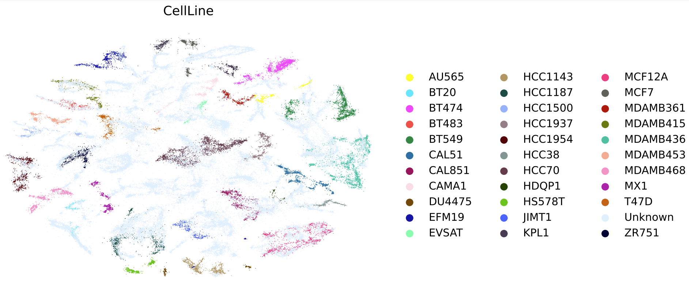
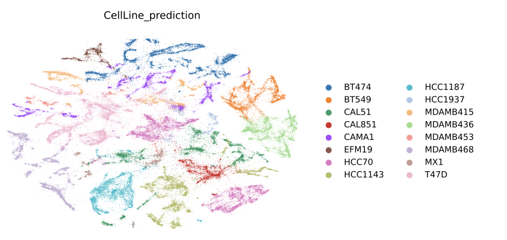
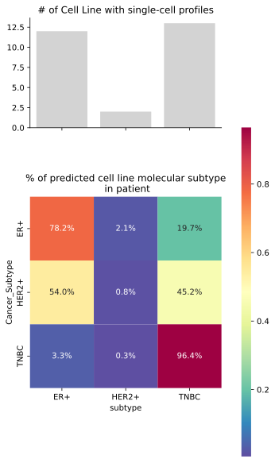
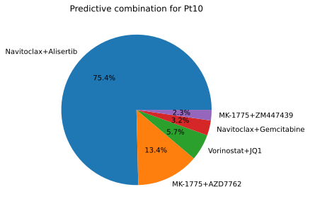
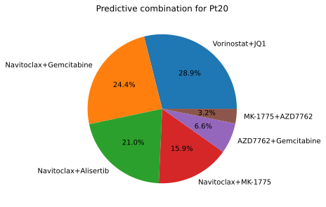

# Identify and prioritize personalized drug combinations by transfer learning from cell line single cell profiles into patient tumor profiles

## Data Availability
- PDL1-treated breast cancer data.
  - Download files locally from the link (https://biokey.lambrechtslab.org/) cause it requires registration.
  - the files should be stored on the `data/raw_data/Bassez_2021`
  
- Single_Cell_Breast_Cancer_cell-line_Atlas.
  - Download files locally from the link (https://figshare.com/articles/dataset/Single_Cell_Breast_Cancer_cell-line_Atlas/15022698) cause it does not support `wget`
  - the files should be stored on the `data/raw_data/Single_Cell_Breast_Cancer_cell-line_Atlas`

- Drug combinations data in breast cancer.
  - Download data from the link (https://figshare.com/articles/dataset/Validation_screen_drug_combination_data/16843600)
  - the files should be stored on the `data/raw_data/drug_response_raw.csv`
- Celline breast cancer subtype annotation.
    - Expert Dr. Josh Gruber mannualy annotate the subtype of each cell line 
    - the annotation result should be stored on the `results/cellline.csv`


## Introduction

Breast cancer treatment depends on analysis of tumor tissue for the expression of common markers including estrogen receptor, progesterone receptor, HER2 and other histological markers. Treatments are guided by these markers, which allow for the selection of hormonal and chemotherapy treatments. However, new technologies make it possible to derive extraordinary level of data from patient biopsies that includes information about a wide range of tumor cells, how they differ from each other and possible aberrations that inform therapy decisions. This project seeks to use patient tumor-derived single-cell RNA (scRNA) sequencing data to inform therapeutic decisions for breast cancer patients. We make use of an existing database of breast cancer cell line treatment results to predict patient-specific drug combinations that could be successful for their tumor.

## Result
### Representing pateint tumors profiles by the cell line profile



### Lack of the representation of HER2+ tumors


### Drug prediction on patient data


### Predicted drug sensitivity profile of each patient





## Method
### Embedding
we build a machine learning system that exploits the knowledge of the underlying biological phenomenon for single-cell representation learning. We construct an interpretable conditional variational autoencoder(CVAE) that allows the incorporation of domain knowledge by performing “architecture programming”, i.e., constraining the network architecture to ensure that each latent dimension captures the variability of known GPs. In this project, we trained the VAE model to integrate the single cell from both patient and cell line data. In that way, we produced a reference latent space by removing technical differences such as batch effects between the reference and the query without access to reference data. 


## Reproduce the result
## Environment settting
```
$ cd <the project folder>
$ make environment
```
When excute following cmd, we have to make sure we are in the right env.
```
$ conda activate pinkPanther
```
## Data prepreocess and clean
```
$ make data_clean
```
## Embedding of single cell data from both patient and cell line
```
$ make embedding
```
This workflow will generate following output:
```
(pinkPanther) [hack033@Nucleus169 panther]$ ls data/embedding/layer3_latent30_dr3
embedding.pdf  prediction.csv  train_X.csv  train_y.csv
```

After we get the embedding and the prediction results on the patient data, we used the `notebooks/cellline_breast_cancer_subtype.ipynb` to explore the percentage of cell line molecular subtype  in three cancer subtypes. This notebook will give us the figure `figures/celline_align_with_patient_subtype.svg`.

## Generate the heatmap summary
```
Rscript code/generate_cell_line_heatmap.R
```
## Training on the drug combination
`code/ML_prediction/model_training.ipynb`


## Predict the drug combination on patient data
`code/ML_prediction/model_prediction.ipynb`

## visualize the prediction result on patient data
`notebooks/prediction_visualization.ipynb`

## Roadmap

What we can achieve in the future with out model if we have more RNA data; what our model can do for the patients

# Author Contributions

